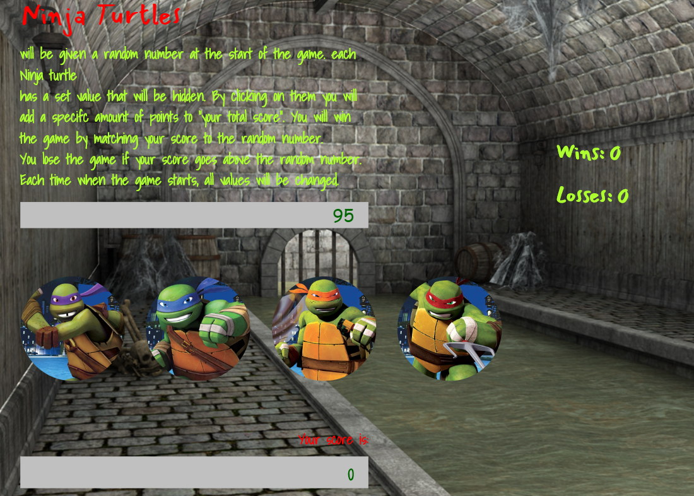

# Ninja Turtle Game

## Live Link

-To view this Game- https://mguaraz120.github.io/Ninja-Turtles-Game/

- My Portfolio:https://mguaraz120.github.io/Portfolio/
- My Linkedin Page:https://www.linkedin.com/in/mario-vizcaino-187ab9104/

## Description on how to use the app

- You will be given a random "number to guess" at the start of the game.
- You have the Ninja Turtles below to help. By clicking on a Turtle you will add a specific amount of points to your total score.
- You win the game by matching your total score to the "number to guess". You lose the game if your total score goes above he random number.
- The value of each Turtle is hidden from you until you click on it.
- Each time the game starts, the values on the Turtles change too!

## Requirements

1. There will be four Turtles displayed as buttons on the page.
2. The player will be shown a random number at the start of the game.
3. When the player clicks on a Turtle, it will add a specific amount of points to the player's total score.
4. Your game will hide this amount until the player clicks a Turtle.
5. When they do click one, update the player's score counter.
6. The player wins if their total score matches the random number from the beginning of the game.
7. The player loses if their score goes above the random number.
8. The game restarts whenever the player wins or loses.
9. When the game begins again, the player should see a new random number. Also, the Turtles will have four new hidden values. Of course, the user's score (and score counter) will reset to zero.
10. The app should show the number of games the player wins and loses. To that end, do not refresh the page as a means to restart the game.

## Game Design Notes

- The random number shown at the start of the game should be between 50 - 120.
- Each crystal should have a random hidden value between 1 - 12.

## Technologies Used

- Jquery for Dom Manipulation
- HTML
- CSS
- Javascript
  
